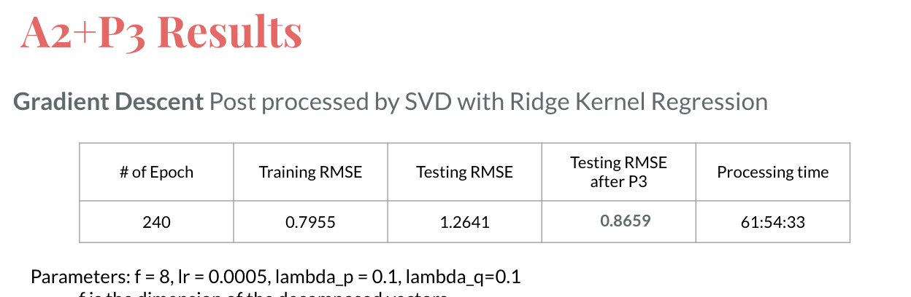

# Project 4: Algorithm implementation and evaluation: Collaborative Filtering

### [Project Description](doc/project4_desc.md)

Term: Fall 2019

+ Team 3

+ Projec title: Recommender System - Implemendation of A1 + P3 vs A2 + P3

+ Team members

	+ Bukhari, Syed Ahsan sab2302@columbia.edu
	
	+ Chen, Luyue lc3363@columbia.edu
	
	+ Cho, Sung In sc4393@columbia.edu
	
	+ Kravitz, Adam ajk2254@columbia.edu
	
	+ Li, Xiaotong xl2788@columbia.edu
	
+ Project summary: In our project, we implemented algorithm A1, A2, P3, and used cross validation method to do parameter selection in A1 and A2. Finally, by combining A1 + P3 and A2 + P3, we further improve the performance on test dataset, and compare each algorithm w.r.t the RMSE, running time.




**Contribution statement**: 

Implementation of A1 algorithm: Everyone

Implementation of A2 algorithm: Luyue Chen, Adam Kravitz, Syed Ahsan Bukhari 

Implementation of P3 algorithm: Sung In Cho, Xiaotong Li

Tuning parameters for A1, A2, P3: Luyue Chen, Xiaotong Li, Sung In Cho, Syed Ahsan Bukhari, Adam Kravitz

Evaluating A1 + P3 and A2 + P3: Xiaotong Li, Sung In Cho

Preparing Slides for presentation: Syed Ahsan Bukhari, Xiaotong Li, Luyue Chen, Sung In Cho, Adam Kravitz

Presentation: Syed Ahsan Bukhari


Following [suggestions](http://nicercode.github.io/blog/2013-04-05-projects/) by [RICH FITZJOHN](http://nicercode.github.io/about/#Team) (@richfitz). This folder is orgarnized as follows.

```
proj/
├── lib/
├── data/
├── doc/
├── figs/
└── output/
```

Please see each subfolder for a README file.
